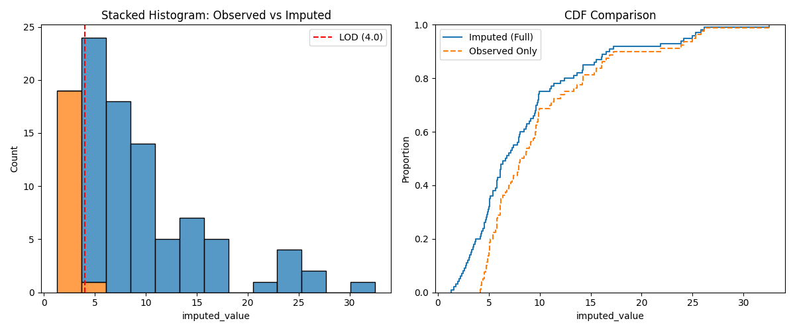

# Example 04: Visualization

This example demonstrates how to visualize the results of imputation using `matplotlib` and `seaborn`.

## Code (`main.py`)
It imputes a synthetic left-censored dataset and generates two plots:
1.  **Stacked Histogram:** Shows where the imputed values (orange) sit relative to the observed values (blue). Notice how they fill in the distribution below the Limit of Detection (LOD).
2.  **CDF Comparison:** Compares the Empirical CDF of the fully imputed dataset against just the observed portion.


```python
"""
Example 04: Visualization Demo

This example shows how to visualize the results of imputation.
Requires 'matplotlib' and 'seaborn'.
"""

import sys
import os
import numpy as np
import pandas as pd

# Check for visualization libraries
try:
    import matplotlib.pyplot as plt
    import seaborn as sns
    HAS_VIZ = True
except ImportError:
    HAS_VIZ = False
    print("Warning: matplotlib and/or seaborn not found. Visualization skipped.")

# Ensure we can import ndimpute from the local source
sys.path.append(os.path.abspath(os.path.join(os.path.dirname(__file__), '../../src')))
from ndimpute import impute

def main():
    if not HAS_VIZ:
        return

    print("--- Example 04: Visualization Demo ---\n")

    # 1. Generate Data (Left Censored) as Strings
    np.random.seed(42)
    true_vals = np.random.lognormal(2, 0.8, 100)
    limit = 4.0

    raw_data = []
    for v in true_vals:
        if v < limit:
            raw_data.append(f"<{limit}")
        else:
            raw_data.append(f"{v:.2f}")

    # 2. Impute
    print("Imputing data...")
    df = impute(raw_data, method='ros')

    # 3. Plotting
    print("Generating plots...")

    # Setup Figure
    fig, axes = plt.subplots(1, 2, figsize=(12, 5))

    # Plot 1: Histogram
    sns.histplot(data=df, x='imputed_value', hue='is_imputed', multiple='stack', ax=axes[0])
    axes[0].set_title('Stacked Histogram: Observed vs Imputed')
    axes[0].axvline(limit, color='red', linestyle='--', label=f'LOD ({limit})')
    axes[0].legend()

    # Plot 2: CDF
    sns.ecdfplot(data=df, x='imputed_value', label='Imputed (Full)', ax=axes[1])

    # Overlay Observed Only
    observed_only = df[~df['is_imputed']]['original_value']
    sns.ecdfplot(x=observed_only, label='Observed Only', linestyle='--', ax=axes[1])

    axes[1].set_title('CDF Comparison')
    axes[1].legend()

    # Save
    # Save to the same directory as the script
    script_dir = os.path.dirname(os.path.abspath(__file__))
    output_file = os.path.join(script_dir, 'visualization_plot.png')

    plt.tight_layout()
    plt.savefig(output_file)
    print(f"Plot saved to {output_file}")

if __name__ == "__main__":
    main()

```

## Output



## Interpretation
The plots visually confirm that the imputation successfully reconstructs the "missing" lower tail of the lognormal distribution.
